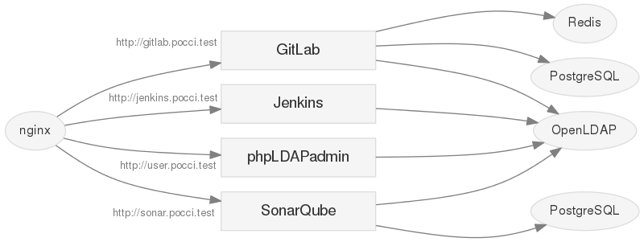

Pocci
=====

Docker コンテナを使った CIサービス構築の試作。



[English](./README.md)

必須ソフトウェア
----------------
*   [Docker](https://www.docker.com/)
*   [Docker Compose](https://github.com/docker/compose/)


インストール方法
----------------
1.  uid=1000 のユーザーに現在のユーザーを変更する。

2.  このリポジトリをクローンする。

    ```bash
    git clone https://github.com/xpfriend/pocci.git pocci
    cd pocci
    ```

3.  ビルドを行う。

    ```bash
    cd bin
    ./build
    ```


利用方法
--------
利用方法に関しては、[サービス開始・利用方法](./document/create-service.ja.md)
を参照してください。
