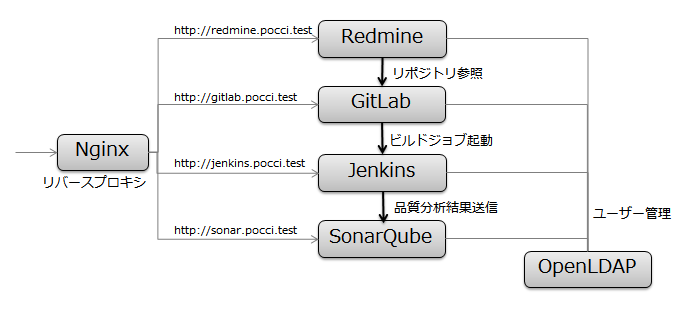

Pocci
=====

Gitリポジトリ管理 (GitLab), CIシステム (Jenkins), チケット管理 (Redmine), 品質分析 (SonarQube)
といったサービスを手軽に構築するための仕組みです。

[English](./README.md)

特徴
----
### オールインワン
GitLab, Jenkins, Redmine, SonarQube
などの様々なソフトウェアを1台のマシンにセットアップすることができます。

### 統合環境
セットアップされた各ソフトウェアはばらばらに動作するのではなく、
ひとつのシステムとして協調動作します。



### 自由にカスタマイズ
[サービス構成の選択やテンプレートの作成](./document/create-service.ja.md)などにより、
ソフトウェア構成を自由にカスタマイズできます。

### 手軽に再セットアップ
一度作成した構成に不満がある場合には、
既存の環境を完全に廃棄して再セットアップを行うことが簡単にできます。  
「別のサービス構成タイプを試してみたい」、「いろいろなテンプレートを試してみたい」
といった場合にも便利です。


導入方法
--------
### A. Pocci-box を利用する場合
[Pocci-box](https://atlas.hashicorp.com/xpfriend/boxes/pocci)は
Pocciを動作させるために必要なOSとソフトウェアを搭載したVMイメージです。

VirtualBox と Vagrant が利用できる環境であれば、
最も簡単に導入可能です。

導入方法の詳細については
[Pocci-boxのREADME](https://github.com/xpfriend/pocci-box/blob/master/README.ja.md)
をご参照ください。


### B. Pocciをそのまま使う場合
#### 必須環境
*   起動するVMに5GB以上割り当て可能な空きメモリをもつマシン
*   [Docker](https://www.docker.com/)
*   [Docker Compose](https://github.com/docker/compose/)
*   デフォルトの構成の場合、以下のポートが使用されます。
    これらのポートを使用するソフトウェアが起動している場合は、
    事前に停止しておく必要があります。

    ポート番号 | 用途
    ---------- | ----------------
    **25**     | SMTPサービス
    **80**     | Web UI
    **389**    | LDAPサービス
    **10022**  | GitLab SSH接続
    **50000**  | Jenkins JNLP接続


#### インストール方法
1.  uid=1000 のユーザーに現在のユーザーを変更する。

2.  このリポジトリをクローンする。

    ```bash
    git clone https://github.com/xpfriend/pocci.git pocci
    cd pocci
    ```

3.  ビルドを行う。

    ```bash
    cd bin
    ./build
    ```


利用方法
--------
利用方法に関しては、[サービス開始・利用方法](./document/create-service.ja.md)
を参照してください。
