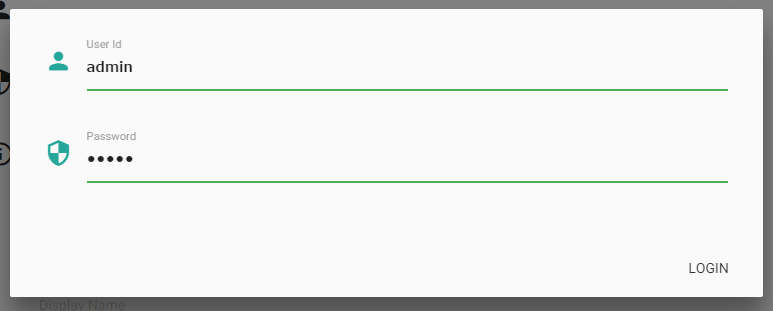
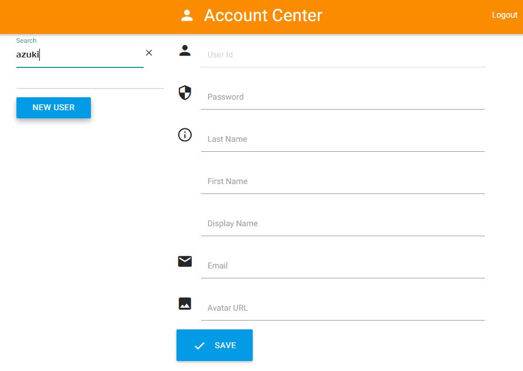

Registering Users
=================

When using the incorporated user administration function (Account Center),
you can register users to the LDAP server as described below.

1.  Access the URL of Account Center (e.g., http://user.pocci.test/).
1.  Enter **User Id** (`admin`) and **Password** (`admin`)
1.  Click **LOGIN**.

    

1.  Enter the id of a new user in **Search**, and click **NEW USER**.

1.  Click **login** on the left side of the screen to display the login screen.

    

1.  Enter the user information and then click **SAVE**.

    
