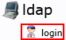
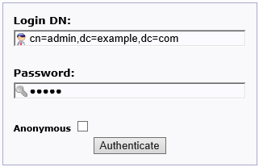

利用者の登録
============

組み込みの利用者管理機能 (user サービス) を利用している場合、
以下の手順で LDAP サーバーに利用者登録を行うことができます。

1.  ブラウザで user サービスのURL（例: http://user.pocci.test/ ）にアクセスする。
2.  画面左側の **login** をクリックしてログイン画面を表示する。

    

3.  **Login DN:** (デフォルト: `cn=admin,dc=example,dc=com`)、
    **Password:** (デフォルト: `admin`) を入力して、
    **Authenticate** ボタンをクリックして、admin 権限でログインする。

    

4.  画面左側の **dc=xxx,dc=xxx*** (デフォルト設定の場合、 `dc=example,dc=com`)
    の左にある **+** ボタンをクリックする。

    

5.  **Create new entry here** をクリックする。

    

6.  **Templates:** の中から一番先頭にある `Courier Mail: Account` を選択する。

    

7.  以下のようにユーザー情報を入力し、**Create Object** をクリックする。
    *   **Given Name :**    名
    *   **Last name :**     姓
    *   **Common Name :**   ユーザーID
        *   自動入力されますが、ユーザーIDに書き換えてください。
    *   **User ID :**       ユーザーID (Common Name と同じにする)
    *   **Email :**         E-mail アドレス
    *   **Password :**      初期パスワード

8.  確認画面が表示されるので **Commit** をクリックする。
