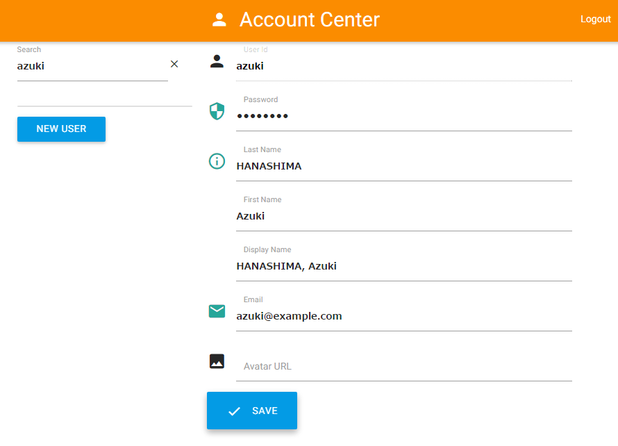

利用者の登録
============

組み込みの利用者管理機能 (Account Center) を利用している場合、
以下の手順で LDAP サーバーに利用者登録を行うことができます。

1.  ブラウザで Account Center のURL（例: http://user.pocci.test/ ）にアクセスし、
    **User Id** (`admin`) と **Password** (デフォルト: `admin`) を入力し、
    **LOGIN** をクリックして admin 権限でログインする。

    

2.  **Search** に作成したい利用者のIDを入力し、**NEW USER** をクリックする。

    

3.  以下のようにユーザー情報を入力し、**SAVE** をクリックする。
    *   **Password :**      初期パスワード
    *   **Last Name :**     姓
    *   **First Name :**    名
    *   **Display Name :**  画面表示名
        *   自動入力されますが、必要に応じて修正してください。
    *   **Email :**         E-mail アドレス
    *   **Avatar URL :**    アイコン画像ファイルのURL (省略可)

    

     *  Email は他のユーザーと重複しないようにしてください。

Account Center では利用者登録のほかに既存利用者の属性情報変更や利用者の削除も可能です。

一般ユーザー（admin 以外のユーザー）でログインした場合、自分自身の属性情報の変更のみができます。
