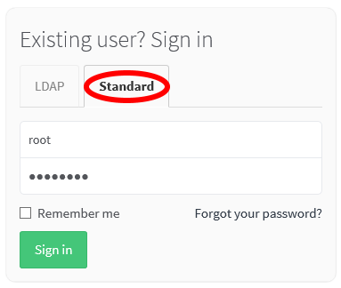
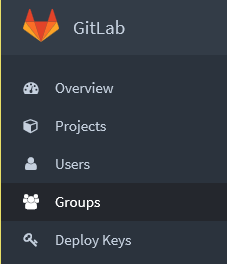
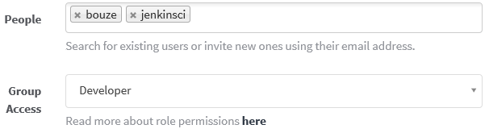

GitLab Setup
============

Contents
--------
*   [A. Creating Groups](#a-)
*   [B. Adding Members](#b-)
*   [C. Creating Projects](#c-)
*   [D. See Also](#d-)

A. Creating Groups
------------------
The "groups" of GitLab are created on a development team (development project) basis.

A group can be created as described below.

1.  Select the **Standard** tab and then sign in as the `root` user.
    *   The default password is `5iveL!fe`.

    

2.  Click **Admin area** of the icons at the top right of the screen.

    

3.  Click **Groups** of the icons on the left side of the screen.
    *  If only icons are displayed on the left side of the screen, text will also be displayed if you increase the width of the window.

    

4.  Click the  button at the top right of the screen.
5.  Enter the path in **Group path** and then
    click the  button.

    

B. Adding Members
-----------------

To enable the users to update the Git repository in the group,
you need to register the members.

Members can be registered as described below.

1.  Sign in to GitLab once as the user to be registered.
2.  Sign in to GitLab as the `root` or as the user with the owner permissions of the group for which member registration is to be performed.
3.  Open the group for which you wish to perform registration and then click  on the left side of the screen.
4.  Click the  button.
5.  Select a user you wish to register in **People** (multiple users can be selected),
    select the permissions to assign to the user in **Group Access**,
    and click .
    * A user who has not signed in to GitLab even once cannot be selected in **People**.
    * For details on permissions, refer to the `Read more about role permissions here` link.

    

C. Creating Projects
--------------------
Creating a "project" in GitLab enables a Git repository to be created.

A project can be created as described below.

1.  Click **New project** of the icons at the top right of the screen.

    

2.  Enter a path in **Project path** and then select **Namespace** (group or user).

    

3.  Select **Visibility Level**.
    *   When `Private` is selected, only the users registered as members to the project to be created
        or to a group to which the project belongs can access the project.
    *   When `Public` is selected, the project can be viewed by users who are not registered as members,
        but only registered members can update (git push) the project.
    *   This setting can also be changed after the project has been created.
    *   Any project registered in setup.*.yml will be set to `Public`.

    

4.  Click the  button.

5.  Register the initial data in accordance with the initial data registration method displayed on the screen.
    *   The method of accessing via SSH is displayed by default,
        but access will not be possible if an SSH key has not been registered.
        Register an SSH key or switch to `HTTP` and access by entering a password.

        

D. See Also
-----------
*  [GitLab](https://gitlab.com/)
*  [sameersbn/gitlab](https://github.com/sameersbn/docker-gitlab)
