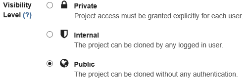

GitLab の設定
=============

目次
----
*   [A. グループの作成](#a-)
*   [B. メンバーの追加](#b-)
*   [C. プロジェクトの作成](#c-)
*   [D. 情報源](#d-)

A. グループの作成
-----------------
GitLab の「グループ」は、開発チーム（開発プロジェクト）の単位で作成します。

以下の操作でグループを作成することができます。

1.  **Standard** タブを選び、`root` ユーザーでサインインする。
    *   デフォルトのパスワードは `5iveL!fe` 。

    

2.  画面右上のアイコンの中の **Admin area** をクリックする。

    

3.  画面左側のアイコンの中の **Groups** をクリックする。
    *   画面左側にアイコンだけが表示されている場合は、画面幅を広げると文字列が表示されます。

    

4.  画面右上の  ボタンをクリックする。
5.  **Group path** を入力し、
     ボタンをクリックする。

    

B. メンバーの追加
-----------------

ユーザーがグループ内の Git リポジトリを更新できるようにするためには、
メンバー登録をする必要があります。

以下の手順でメンバー登録できます。

1.  登録するユーザーで GitLab に一度サインインしておく。
2.  `root` もしくはメンバー登録するグループのオーナー権限を持つユーザーで GitLab にサインインする。
3.  登録したいグループを開き、画面左の  をクリックする。
4.   ボタンをクリックする。
5.  **People** で登録したいユーザーを選択し (複数選択可能)、
    **Group Access** でユーザーに与える権限を選択し、
     をクリックする。
    *   GitLab に一度もサインインしたことのないユーザーは **People** で選択できません。
    *   権限については `Read more about role permissions here` のリンクを参考にしてください。

    

C. プロジェクトの作成
---------------------
GitLab では「プロジェクト」を作成することにより、 Git リポジトリを作成できます。

以下の操作でプロジェクトを作成することができます。

1.  画面右上のアイコンの中の **New project** をクリックする。

    

2.  **Project path** を入力し、**Namespace** (グループまたはユーザー) を選択する。

    

3.  **Visibility Level** を選択する。
    *   `Private` を選択した場合、
        作成するプロジェクトまたは作成するプロジェクトが所属するグループにメンバー登録されたユーザーだけアクセスできます。
    *   `Public` を選んだ場合、メンバー登録されていないユーザーからの参照が可能になりますが、
        更新（git push）はメンバー登録されたユーザーしかできません。
    *   この設定は作成後に変更することも可能です。
    *   setup.*.yml で登録したプロジェクトは `Public` の設定になっています。

    

4.   ボタンをクリックする。

5.  画面上に、初期データ登録の方法が表示されるので、それに従い初期データ登録を行う。
    *   デフォルトでは SSH 経由でのアクセス方法が表示されていますが、
        SSH キーを登録していない場合はアクセスできません。
        SSH キーを登録するか、`HTTP` に切り替えてパスワードアクセスを行ってください。

        

D. 情報源
---------
*   [GitLab](https://gitlab.com/)
*   [sameersbn/gitlab](https://github.com/sameersbn/docker-gitlab)
