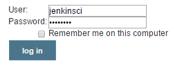
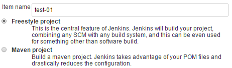
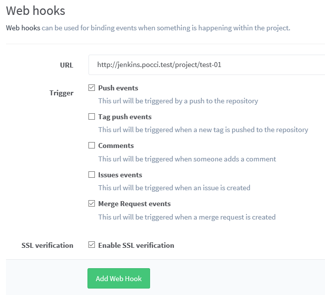
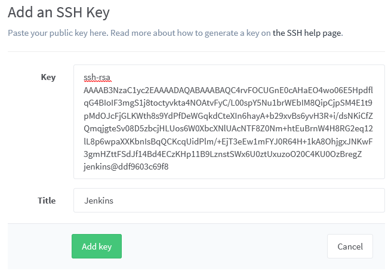
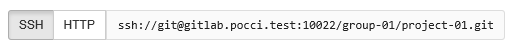

Jenkins Setup
=============

Contents
--------
*   [A. Creating a Job](#a-)
*   [B. Creating a Slave Node](#b-)
*   [C. See Also](#c-)

A. Creating a Job
-----------------
A job can be created as described below.
* The following is just one example of how to create a job (a job does not always necessarily have to be created in this way). 

### 1. Setup in Jenkins
1.  Click  at the top right of the screen.
2.  Enter the user name and password and then log in.

    

3.  Click  at the top left of the screen.
4.  Enter any job name in **Item name**, select **Freestyle project**,
    and click .

    

5.  Select the **Restrict where this project can be run** check box and then
    specify the name of a Jenkins slave node that is already registered
    ('java' or 'nodejs' when default setting) in **Label Expression**.

    

6.  Select `Git` for **Source Code Management**,
    enter the URL of the Git repository in **Repository URL**,
    and delete the character string entered in **Branch Specifier (blank for 'any')**.

    

    *   The example of the case where access without authentication (git clone) to the Git repository is possible
        (when using a `Public` project of GitLab) is described here (an example of access to a 
        repository that requires authentication is described later).
    *   The **Repository URL** is displayed on the project page of GitLab as shown below.

        

    *   If **Branch Specifier** is left blank, 
        all branches will be target for building when building of the job is executed.

7.  Click **Build when a change is pushed to GitLab. GitLab CI Service URL: ...**
    of **Build Triggers** and then select all displayed check boxes.

    

    *   Save the URL string that is displayed after
        **GitLab CI Service URL:** (as it will be used later).

        

8.  Select `Execute shell` in **Add build step** of **Build**.

    

9.  Describe the script to perform the build process in **Command" of **Execute shell**.

    

    *   In this example, we describe the calling of the script `build.sh` to actually perform the build process. 
        For details on `build.sh`, refer to `template/code/example/example-java/build.sh`
        and `template/code/example/example-nodejs/build.sh`.

10. If there are any other necessary settings, add them and then
    click .

### 2. Setup in GitLab
1.  Sign in to *GitLab** as root, master of the target project,
    or user with owner permissions.

2.  Open the project page and then click 
    on the left side of the screen.

3.  Click the  button.
8.  Configure the following settings and then click **Add Web Hook**.
    *  Paste the URL that was displayed in 
       **Build Triggers - Build when a change is pushed to GitLab. GitLab CI Service URL: ...**   
       of **Jenkins configuration screen** into **URL**.
    *  Select the **Merge Request events** check box.

    

9.  Click the  button.
    and check that building begins in Jenkins.

### 3. When Job That Uses a Repository Requiring Authentication
If authentication is required when accessing the repository
(when accessing a `Private` project of GitLab),
the following additional work needs to be performed.

1. Creating a Jenkins User
2. Registering an SSH Key
3. Changing the Job Settings

#### 1. Creating a Jenkins User
You need to create a user for the Jenkins build and
configure the settings to enable access to the GitLab group or project.

Refer to [Registering Users](./add-user.en.md) for details on creating users and
[GitLab Settings - B. Adding Members](./gitlab.en.md#b-)
for details on the access settings of GitLab.

#### 2. Registering an SSH Key
SSH keys are stored in the a file called `id_rsa.pub`
in the `config/.ssh` directory.
* This file is created when `create-config` is executed.

Registering an SSH key described in this file to
GitLab and Jenkins enables access to a Git
repository that requires authentication.

##### Registering an SSH Key to GitLab
An SSH key can be registered to GitLab as described below.

1. Sign in to GitLab as a user for the Jenkins build and then open the **Profile settings** screen.
2. Click **SSH Keys** on the left side of the screen.

    

3. Click the  button.

4. Enter the following information and then click the **Add key** button.
    *   **Title:** Any title.
    *   **Key:** Paste the contents of the `config/.ssh/id_rsa.pub` file.
        *   Correct registration will not be possible if a line break is entered in the middle so be sure to enter this as one line.

    

##### Registering an SSH Key to Jenkins
An SSH key can be registered to Jenkins as described below.

1. Log in to Jenkins and then click .
2. Click  on the left of the screen.
3. Click .
4. Click .
5. Configure the following settings and then click **OK**.
    *   **Kind:** `SSH Username with private key`
    *   **Scope:** `Global`
    *   **Username:** User name for the Jenkins build that was registered in GitLab
    *   **Private Key:** `From the Jenkins master ~/.ssh`

    

#### 3. Changing the Job Settings
Change the **Repositories** settings of Source Code Management as shown below.
*   Change the URL of **Repository URL** to the URL for SSH access of GitLab.
    *   The URL for SSH access can be checked on the project screen of GitLab.

        

*   In **Credentials**, select a user name for the Jenkins build that was registered in GitLab.

B. Creating a Slave Node
------------------------
A Jenkins slave node can be created as described below.

1.  Log in to Jenkins and then click .
2.  Click the **Manage Nodes** button.

    

3.  Click  on the left side of the screen.
4.  Enter any node name in **Node name**, select **Dumb Slave** or **Copy Node**
    (if copying of a node was selected, enter the name of the existing node),
    and click **OK**.

    

5.  Configure the following settings and then click **Save**.
    *   **Remote root directory:** Directory on the node for the Jenkins slave node to operate
    *   **Launch method:** Launch slave agents via Java Web Start
    *   For the other settings, 
        read the information of  
        and then configure the settings accordingly.

    

6.  Click the name of the node you created in the node list.

    

7.  Download **slave.jar** on the machine for the Jenkins slave and then
    save it to the directory you specified in **Remote FS root** when configuring the node.

    

8.  Execute the command shown below **Run from slave command line:**
    on the machine for the Jenkins slave.
    * We recommend saving the command as a shell script or batch file.

    

C. See Also
-----------
*   [Jenkins](https://jenkins-ci.org/)
*   [gitlab-plugin](https://github.com/jenkinsci/gitlab-plugin)
