Jenkins の設定
==============

目次
----
*   [A. ジョブの作成](#a-)
*   [B. スレーブノードの作成](#b-)
*   [C. 情報源](#c-)

A. ジョブの作成
---------------
以下のような手順でジョブ作成できます。
*   以下はジョブ作成手順の一例です（必ずこの手順で作成しなければらない、というわけではありません）。

### 1. Jenkins 側の設定
1.  画面右上の  をクリックする。
2.  ユーザー名とパスワードを入力してログインする。

    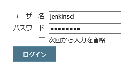

3.  画面左上の  をクリックする。
4.  任意の **ジョブ名** を入力し、**フリースタイル・プロジェクトのビルド** を選択し、
     をクリックする。

    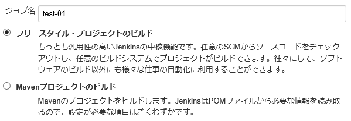

5.  **実行するノードを制限** にチェックを入れて、
    **ラベル式** に登録済みの Jenkinsスレーブノードの名前
    (デフォルト設定の場合 `java` もしくは `nodejs`)
    を指定する。

    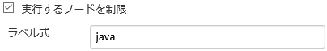

6.  **ソースコード管理** で `Git` を選択し、
    **Repository URL** に Git リポジトリの URL を入力し、
    **Branch Specifier (blank for 'any')** に入力されている文字列を削除する。

    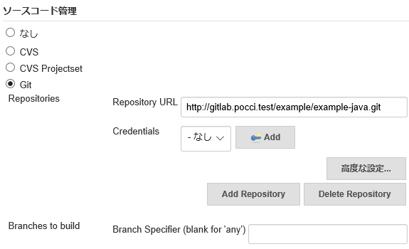

    *   ここでは Git リポジトリに認証なしでアクセス (git clone) できるケース
        (GitLab の `Public` プロジェクトを利用している場合) を例にして説明しています
        (認証が必要なリポジトリにアクセスする例は後述します) 。
    *   **Repository URL** は GitLab 
        のプロジェクトページ内で以下のように表記されている部分で確認できます。

        

    *   **Branch Specifier** を未入力状態にするとすべてのブランチを対象にしてビルドジョブ実行します。

7.  **ビルド・トリガ**の
    **Build when a change is pushed to GitLab. GitLab CI Service URL: ...**
    をクリックして、表示されるチェックボックスをすべてチェックする。

    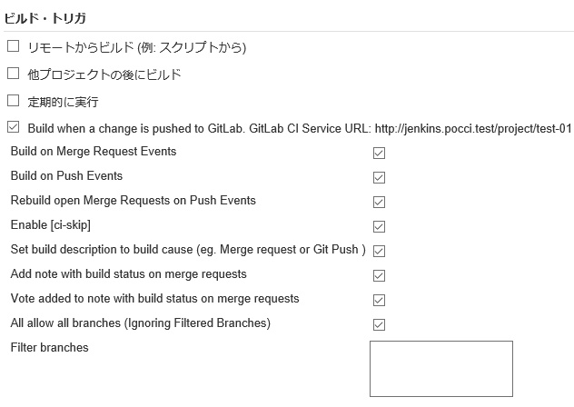

    *   ここで **GitLab CI Service URL:** 以降に表示されている URL 文字列を
        どこかに保存しておいてください (あとで利用します)。

        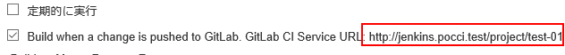

8.  **ビルド** の **ビルド手順の追加** で `シェルの実行` を選択する。

    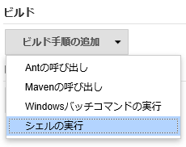

9.  **シェルの実行** の **シェルスクリプト** にビルド処理を行うスクリプトを記述する。

    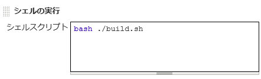

    *   この例では、実際にビルド処理を行うスクリプト `build.sh` の呼び出しを記述しています。
        `build.sh` の内容については `template/code/example/example-java/build.sh` や
        `template/code/example/example-nodejs/build.sh` を参考にしてください。

10. その他、必要な設定があれば追加し、
     をクリックする。

### 2. GitLab 側の設定
1.  root もしくは対象プロジェクトの Master もしくは Owner 権限を持つユーザーで
    **GitLab** にサインインする。

2.  プロジェクトのページを開き、画面左側の
     をクリックする。

3.   ボタンをクリックする。
8.  以下の設定を行い、**Add Web Hook** をクリックする。
    *   **URL** に **Jenkins 設定画面** の 
        **ビルド・トリガ - Build when a change is pushed to GitLab. GitLab CI Service URL: ...**
        に表示されていた URL を貼り付ける。
    *   **Merge Request events** をチェックする。

    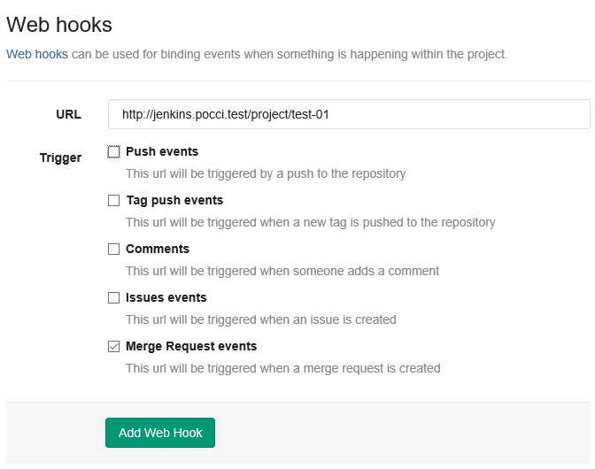

9.  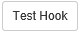 ボタンをクリックして
    Jenkins でビルドが始まることを確認する。

### 3. 認証が必要なリポジトリを利用するジョブの場合
リポジトリにアクセスする際に認証が必要な場合
(GitLab の `Private` プロジェクトにアクセスする場合) は、
以下の作業を追加で実施する必要があります。

1.  Jenkins ユーザーの作成
2.  SSH キー登録
3.  ジョブ設定の変更

#### 1. Jenkins ユーザーの作成
Jenkins ビルド用のユーザーを作成して、
GitLab のグループまたはプロジェクトにアクセスできるように設定する必要があります。

ユーザー作成に関しては [利用者の登録](./add-user.ja.md) を、
GitLab のアクセス設定に関しては
[GitLabの設定 - B.メンバーの追加](./gitlab.ja.md#b-)
を参考にして行ってください。

#### 2. SSH キー登録
`config/.ssh` ディレクトリには、`id_rsa.pub` という名前のファイルに
SSH キーが格納されています。
*   このファイルは `create-config` を実行したときに作成されたものです。

このファイルに記述されている SSH キーを
GitLab および Jenkins に登録することにより、
認証が必要な Git リポジトリにアクセスできるようになります。

##### GitLab への SSH キー登録
以下の手順で GitLab に SSH キーを登録できます。

1.  Jenkins ビルド用ユーザーで GitLab にサインインし、、**Profile settings** 画面を開く。
2.  画面左側の **SSH Keys** をクリックする。

    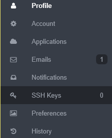

3.   ボタンをクリックする。

4.  以下の内容を入力し、**Add key** ボタンをクリックする。
    *   **Title:** 任意のタイトル。
    *   **Key:** `config/.ssh/id_rsa.pub` ファイルの内容を貼り付ける。
        *   途中に改行が入ると正しく登録できないので、必ず1行で入力すること。

    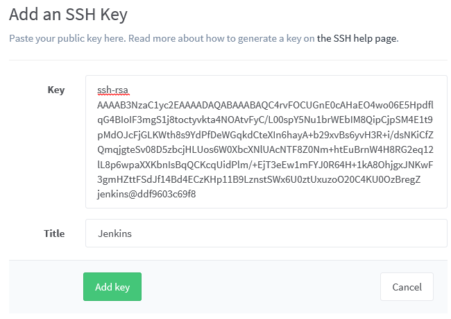

##### Jenkins への SSH キー登録
以下の手順で Jenkins に SSH キーを登録できます。

1.  Jenkins にログインし、  をクリックする。
2.  画面左側の  をクリックする。
3.   をクリックする。
4.   をクリックする。
5.  以下の設定を行い、**OK** をクリックする。
    *   **種類:** `SSHユーザー名と秘密鍵`
    *   **スコープ:** `グローバル`
    *   **ユーザー名:** GitLab に登録した Jenkins ビルド用ユーザー名
    *   **秘密鍵:** `Jenkinsマスター上の~/.sshから`

    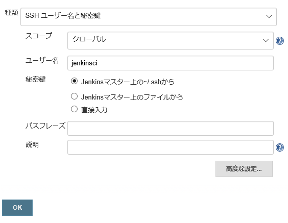

#### 3. ジョブ設定の変更
ソースコード管理の **Repositories** 設定を以下のように変更してください。
*   **Repository URL** を GitLab の SSH アクセス用 URL に変更する。
    *   SSH アクセス用 URL は GitLab のプロジェクト画面で確認できます。

        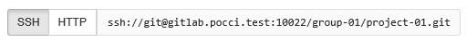

*   **Credentials** で、GitLab に登録した Jenkins ビルド用ユーザー名を選択する。

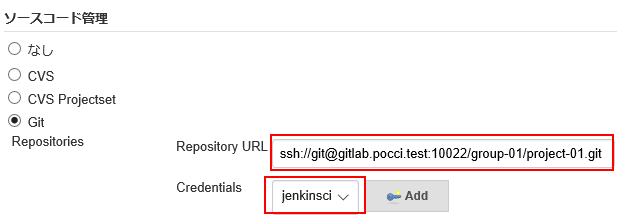

B. スレーブノードの作成
-----------------------
Jenkins スレーブノードは以下のようにして作成できます。

1.  Jenkins にログインし、  をクリックする。
2.  **ノードの管理** ボタンをクリックする。

    

3.  画面左側の  をクリックする。
4.  任意の**ノード名**を入力し、**ダムスレーブ**または**ノードのコピー**を選択して
    (ノードのコピーを選択した場合は既存ノードをの名前を入力して)、
    **OK**をクリックする。

    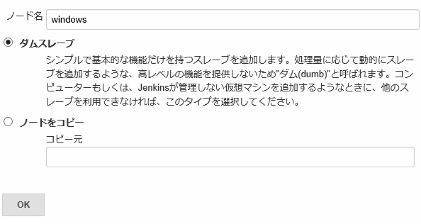

5.  以下の設定を行い、**保存** をクリックする。
    *   **リモートFSルート:** Jenkins スレーブノードが動作するための、ノード上のディレクトリ
    *   **起動方法:** JNLP経由でスレーブを起動
    *   その他については、  に記載されている内容を読み設定を行う。

    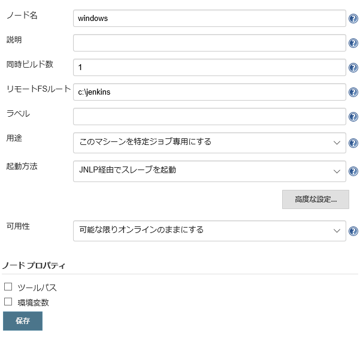

6.  ノード一覧の中から、作成したノードの名前をクリックする。

    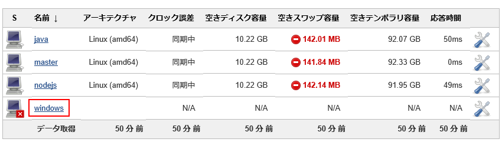

7.  Jenkins スレーブ用のマシン上で **slave.jar** をダウンロードして、
    ノードの設定時に **リモートFSルート** で指定したディレクトリに保存する。

    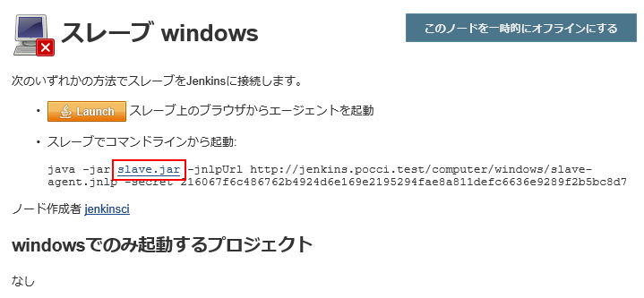

8.  **スレーブでコマンドラインから起動:** の下に書かれているコマンドを
    Jenkins スレーブ用のマシンで実行する。
    *   シェルスクリプトやバッチファイルとして保存しておくのがおすすめです。

    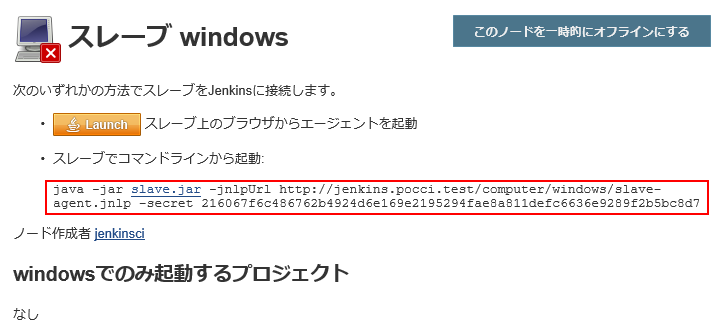

C. 情報源
---------
*   [Jenkins](https://jenkins-ci.org/)
*   [gitlab-plugin](https://github.com/jenkinsci/gitlab-plugin)
