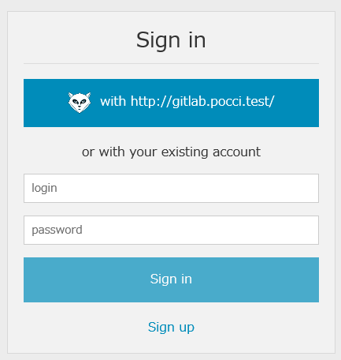
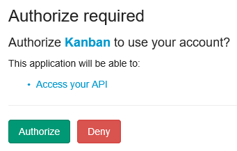
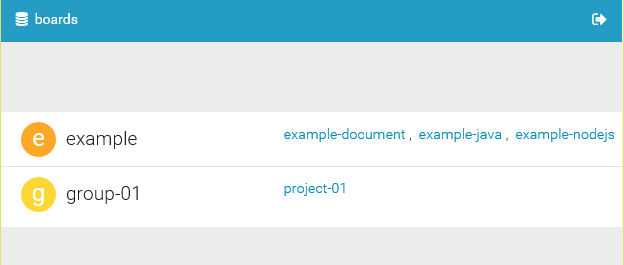
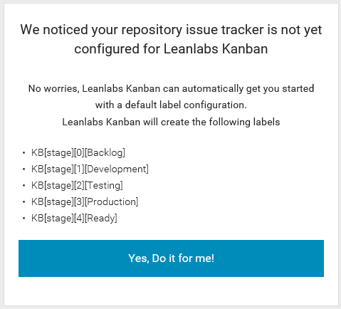
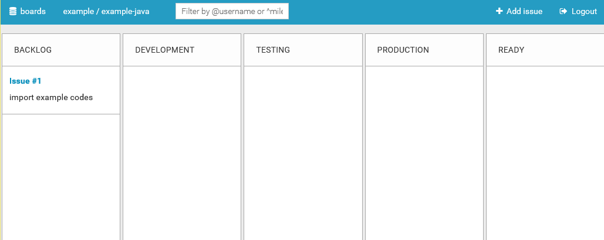
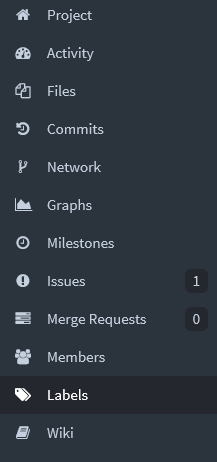
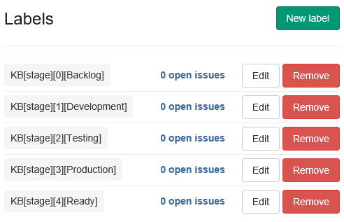
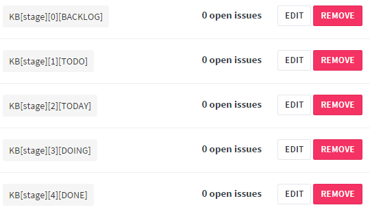
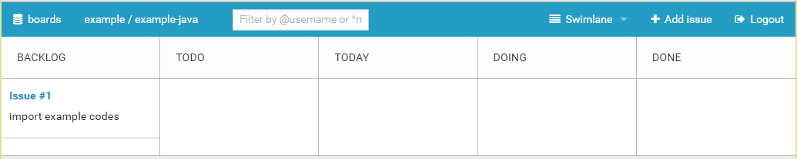

Kanban Board Setup
==================

Contents
--------
*   [A. Initial Setup](#a-)
*   [B. Customizing](#b-)
*   [C. See Also](#c-)

A. Initial Setup
----------------
Use of the kanban board can be started as described below.

1.  Sign in to GitLab before accessing the kanban board.
2.  Access the kanban board and then click
    the button at the very top
    (button indicated by **with http://....**).

    

3.  When **Authorize required** appears in another screen as shown below,
    click **Authorize**.

    

4.  The project list appears. Click the project
    you wish to use the kanban board.

    

5.  If the stages have not been defined in advance in the setup file (`setup.*.yml`),
    a screen such as the following appears.
    Click **Yes, Do it for me!**.

    

6.  A task board appears and use becomes possible.

    

B.. Customizing
---------------
The character string of each stage of the task board can be changed 
and the number of stages can be increased or reduced 
by editing the corresponding label in GitLab.

1.  Open GitLab and then click **Labels** on the left side of the screen.

    

2.  Labels such are the following are registered in the initial state.

    

    *   The labels are in the format of `KB[stage][number][stage name]`
        so you can change a stage name on a task board by clicking the **Edit** button
        and then changing the [stage name] part.
    *   To remove a stage, click the **Remove** button.
    *   To add a stage, click the **New label** button and then
        create a new label in the `KB[stage][number][stage name]` format.

Updated label example:

Task board example:

C. See Also
-----------
*   [GitLab Kanban Board](http://kanban.leanlabs.io/)
