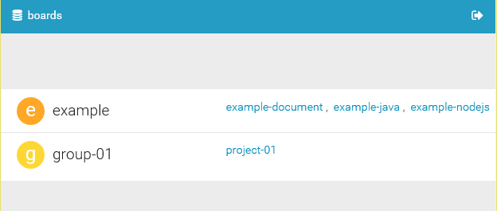
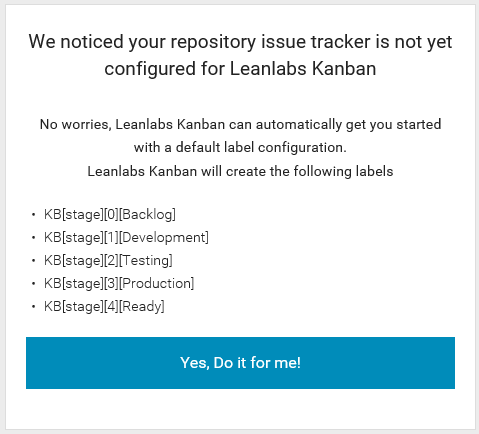
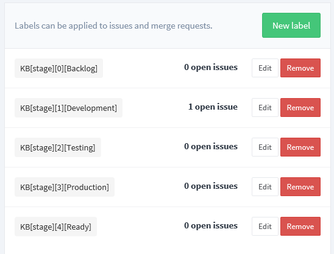

かんばんボードの設定
====================

目次
----
*   [A. 初期設定](#a-)
*   [B. カスタマイズ](#b-)
*   [C. 情報源](#c-)

A. 初期設定
-----------
かんばんボードは以下のような手順で利用開始できます。

1.  かんばんボードにアクセスする前に GitLab にサインインしておく。
2.  かんばんボードにアクセスし、
    一番上のボタン (**with http://....** と書かれているボタン)
    をクリックする。

    

3.  以下のように別画面で **Authorize required** と表示されたら、
    **Authorize** をクリックする。

    

4.  プロジェクトの一覧が表示されるので、
    かんばんボードを利用したいプロジェクトをクリックする。

    

5.  セットアップファイル (`setup.*.yml`) で事前に工程 (stage)
    の定義を行っていない場合は以下のような画面が表示されるので、
    **Yes, Do it for me!** をクリックする。

    

6.  タスクボードが表示され、利用可能になる。

    

B. カスタマイズ
---------------
GitLab のラベルを編集することにより、
タスクボードの各工程 (Stage) の文字列を変更したり、
工程の数を増減させることができます。

1.  GitLab を開き、画面左側の **Labels** をクリックする。

    

2.  初期状態では以下のようなラベルが登録されている。

    

    *   ラベルは `KB[stage][番号][工程名]` の形式になっているため、
        **Edit** ボタンをクリックして、`[工程名]` の部分を変更すれば、
        タスクボード上の工程名を変更することができる。
    *   工程を削除するには、**Remove** ボタンをクリックする。
    *   工程を追加するには、**New label** ボタンをクリックして、
        `KB[stage][番号][工程名]` 形式のラベルを作成する。

ラベル変更例:

タスクボード例:

C. 情報源
---------
*   [GitLab Kanban Board](http://kanban.leanlabs.io/)
