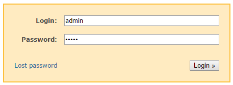
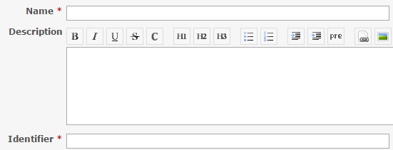
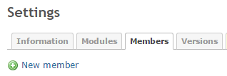
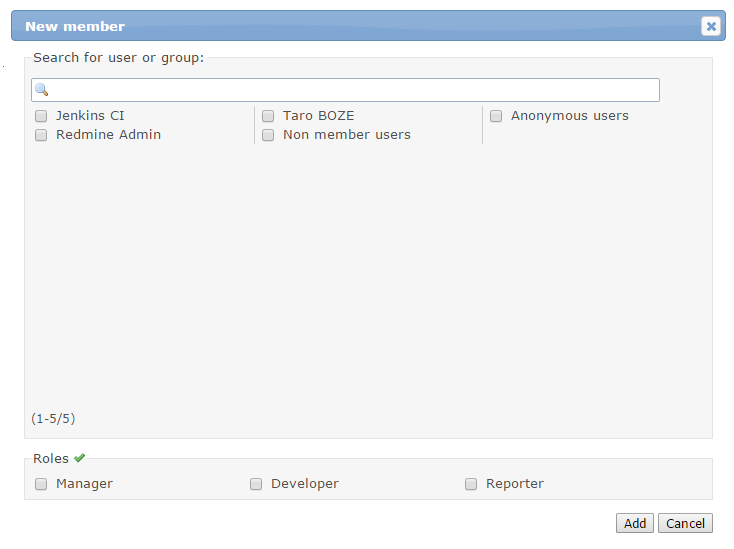
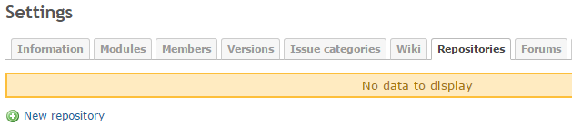
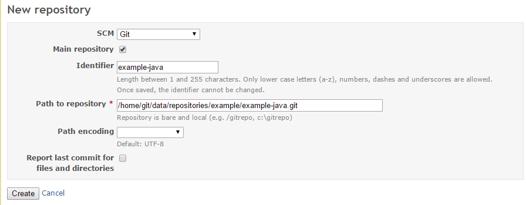

Redmine Setup
=============

Contents
--------
*   [A. Creating Projects](#a-)
*   [B. Linking with GitLab](#b-)
*   [C. See Also](#c-)

A. Creating Projects
--------------------
A project can be created as described below.

1.  Click  at the top right of the screen,
    enter `admin` for **Login:** and `admin` for **Password:**,
    and click **Login**.

    

2.  Click  at the top left of the screen
    and then click .

3.  Enter the project name in **Name** and then
    click .
    *   An identifier must also be entered in **Identifier**.
        When the name is entered, the same name is also entered automatically for the identifier.

    

4.  Click the **Members** tab and then
    click **New member**.

    

5.  Select the check boxes for the users that will use the created project and for the roles
    assigned to those users under **Roles** and then click **Add**.
    *   A user who has not logged in to Redmine even once will not be displayed on this screen
        so you will need to log in once as that user in advance.

    

6.  Click the **Repositories** tab and then
    click **New repository**.

    

7.  Enter the information as shown below and then click **Create**.
    *   **SCM:** `Git`
    *   **Identifier:** Any name
    *   **Path to repository:** `/home/git/data/repositories/[group name of GitLab]/[project name of GitLab].git`

    

B. Linking with GitLab
----------------------
To use Redmine instead of a GitLab standard Issue,
configure the settings as follows in GitLab.

1.  Log in to GitLab as the user with the owner permissions of the group.
2.  Open the project page for which the settings are to be configured and then click 
     on the left side of the screen.
3.  Click .
4.  Click  in the list.
5.  Configure the following settings and then click **Save**.
    *  Select the **Active** check box.
    *  Enter the URL of the top page of the Redmine project in **Project url**.
    *  Enter `Redmine URL` + `/issues/:id` in **Issues url**.
    *  Enter `URL of top page of Redmine project` + `/issues/new` in **New issue url**.

    

C. See Also
-----------
*  [Redmine](http://www.redmine.org/)
*  [sameersbn/redmine](https://github.com/sameersbn/docker-redmine/)
