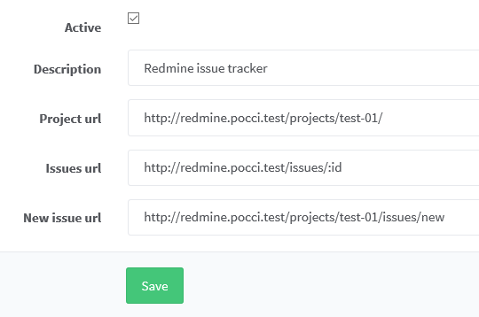

Redmine の設定
==============

目次
----
*   [A. プロジェクトの作成](#a-)
*   [B. GitLab との連携](#b-)
*   [C. 情報源](#c-)

A. プロジェクトの作成
---------------------
以下のような操作でプロジェクトを作成できます。

1.  画面右上の  をクリックし、
    **ログイン:** `admin`、**パスワード:** `admin`
    で **ログイン** をクリックする。

    

2.  画面左上の 
    をクリックし、
    をクリックする。

3.  **名前** にプロジェクト名を入力し、
     をクリックする。
    *   **識別子** にも入力が必要ですが、
        名前を入力すると識別子にも同じものが自動入力されます。

    

4.  **メンバー** タブをクリックして、
    **新しいメンバー** をクリックする。

    

5.  作成したプロジェクトを利用するユーザーとそのユーザーに割り当てる
    **ロール** をチェックして、**追加** をクリックする。
    *   Redmine に一度もログインしたことのないユーザーはこの画面に現れないため、
        事前にそのユーザーで一度ログインしておく必要があります。

    

6.  **リポジトリ** タブをクリックして、
    **新しいリポジトリ** をクリックする。

    

7.  以下のように入力して、**作成** をクリックする。
    *   **バージョン管理システム:** `Git`
    *   **識別子:** 任意の名前
    *   **リポジトリのパス:** `/home/git/data/repositories/GitLabのグループ名/GitLabのプロジェクト名.git`

    

B. GitLab との連携
------------------
GitLab 標準の Issue の代わりに Redmine を使用するには、
GitLab で以下のような設定を行います。

1.  グループのオーナー権限を持つユーザーで GitLab にログインする。
2.  設定を行うプロジェクトを開き、画面左側の 
     をクリックする。
3.   をクリックする。
4.  一覧の中の  をクリックする。
5.  以下の設定を行い、**Save** をクリックする。
    *   **Active** にチェックを入れる。
    *   **Project url** に Redmine プロジェクトのトップページの URL を入力する。
    *   **Issues url** に `Redmine のURL` + `/issues/:id` を入力する。
    *   **New issue url** に `Redmine プロジェクトのトップページの URL` + `/issues/new` を入力する。

    

C. 情報源
---------
*   [Redmine](http://www.redmine.org/)
*   [sameersbn/redmine](https://github.com/sameersbn/docker-redmine/)
