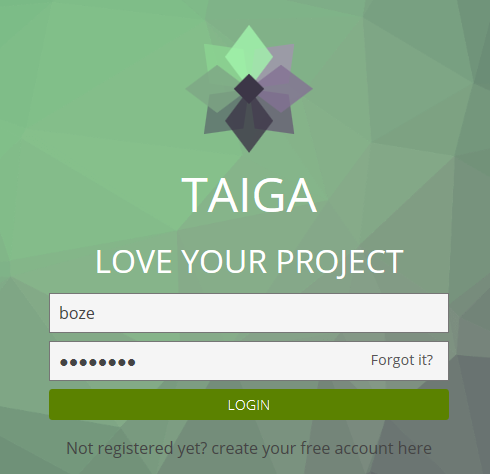
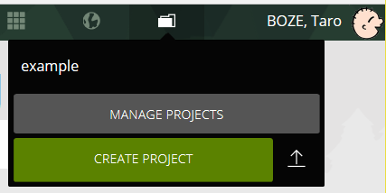
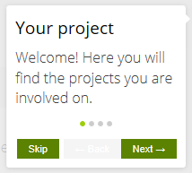
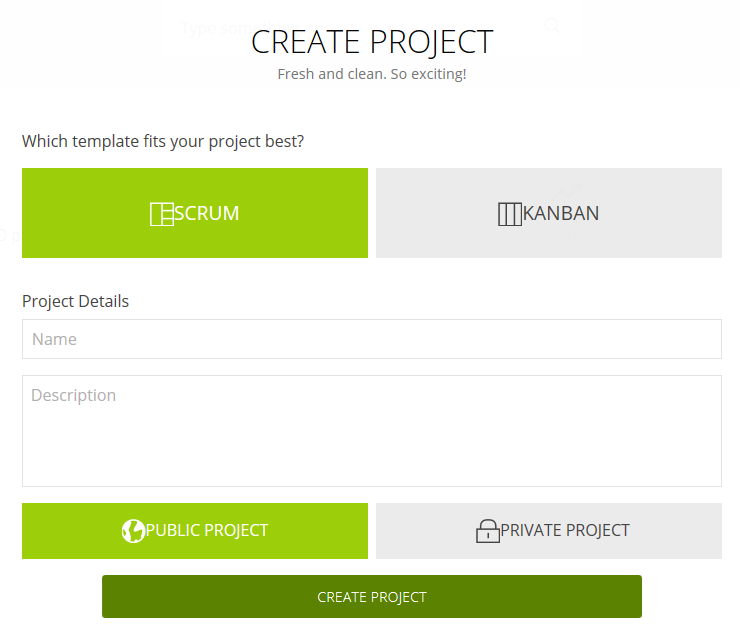

Taiga の設定
============

目次
----
*   [A. プロジェクトの作成](#a-)
*   [B. GitLab との連携](#b-)
*   [C. 注意事項](#c-)
*   [D. 情報源](#d-)

A. プロジェクトの作成
---------------------
以下のような操作でプロジェクトを作成できます。

1.  画面右上の  をクリックし、
    初期登録したユーザーとパスワード（デフォルトの場合 `boze/password`）
    で **LOGIN** をクリックする。

    

2.  画面上部の 
    を選択し、 **CREATE PROJECT** をクリックする。

    

    もし 
    が表示されていない場合は、
    画面上部の 
    を選択しし、 
    をクリックする。

    ここで以下のようなヘルプ表示が出た場合は  
    をクリックして一通りヘルプを読むか、 
    をクリックしてヘルプを閉じるかしてください。

    

3.  プロジェクト作成画面が開くので、以下の操作をしてください。
    1.  "SCRUM" と "KANBAN" のどちらのテンプレートを使って
        プロジェクト作成するかを選択する。

        この選択によってプロジェクトで利用できる画面が変わります
        (例えば KANBAN を選択した場合は BACKLOG 画面は表示されません)
        が、作成後でも簡単に変更できるため、ここであまり悩む必要はありません。
    2.  プロジェクト名 (Name) とプロジェクト説明 (Description) を入力する。
    3.  公開/非公開のいずれにするかを選択する。
    4.  **CREATE PROJECT** をクリックする。

    

4.  画面左端の一番下にある 
    をクリックするとプロジェクト管理画面で様々な設定を行うことができます。

    以下のような設定が可能です。

    *   PROJECT:
        *   PROJECT DETAILS: プロジェクト情報の設定
        *   DEFAULT VALUES: 各種選択項目のデフォルト値設定
        *   MODULES: 利用する機能（画面）の選択
        *   ...
    *   ATTRIBUTES:
        *   STATUS: エピック、ユーザーストーリー、タスク、課題(Issue) のステータス設定
        *   POINTS: ストーリーポイント設定
        *   PRIORITES: 課題の優先度設定
        *   CUSTOM FIELDS: カスタム項目の追加
        *   ...
    *   MEMBERS: プロジェクトへのメンバー追加
    *   PERMISSIONS: ロールと権限の設定
    *   INTEGRATIONS: 他システム連携設定

B. GitLab との連携
------------------
GitLab に登録された Issue を Taiga の Issue に反映することができます。

具体的な設定方法については、
[Gitlab Integration](https://tree.taiga.io/support/integrations/gitlab-integration/)
を参照してください。

なお、Pocci で作成したプロジェクトにはこの設定が自動的に行われています。

C. 注意事項
-----------
Taiga にログインしたままログアウトせずに 
[create-service / create-config](./create-service.ja.md) 
でサービスの再作成を行った場合、
**「ログイン画面でリロードが無限に繰り返される」**
という現象が発生します。

この現象が発生したときには、以下の手順で対応できます。

1.  ブラウザ画面で F12 ボタンを押して開発者ツールを開く
2.  開発者ツールのコンソールで `window.localStorage.clear();` を実行する
3.  上記のスクリプト実行により、リロードが止まるため、
    一旦ログアウトして、再度ログインを行う。

D. 情報源
---------
*   [Taiga.io](https://taiga.io/)
*   [Taiga.io(GitHub)](https://github.com/taigaio/)
*   [Taiga REST API](https://taigaio.github.io/taiga-doc/dist/api.html)
*   [xpfriend/taiga-back](https://hub.docker.com/r/xpfriend/taiga-back/)
*   [xpfriend/taiga-front](https://hub.docker.com/r/xpfriend/taiga-front/)
