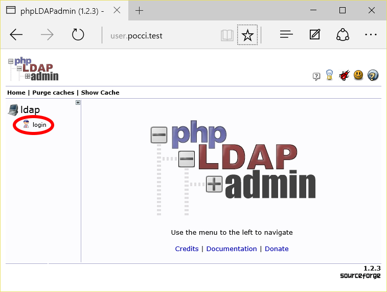
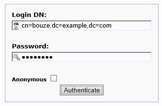
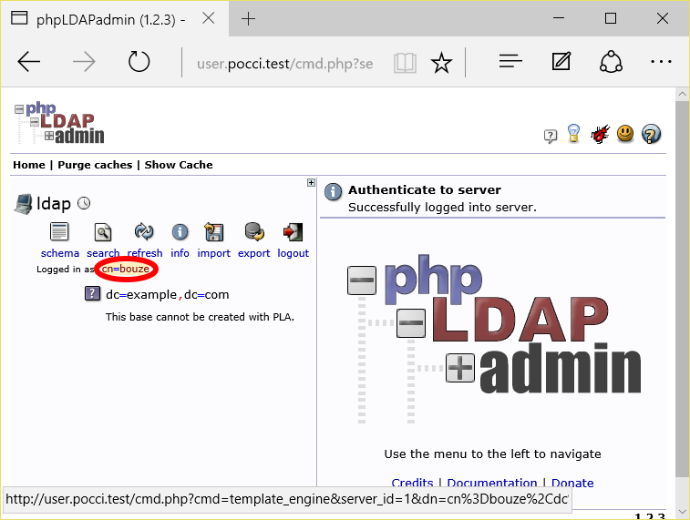
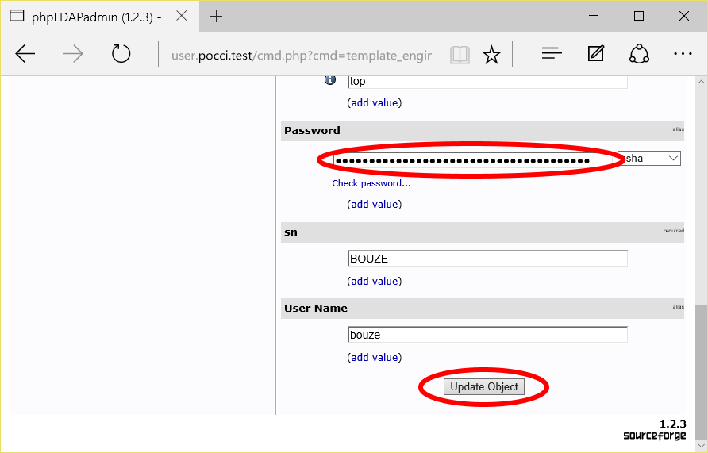
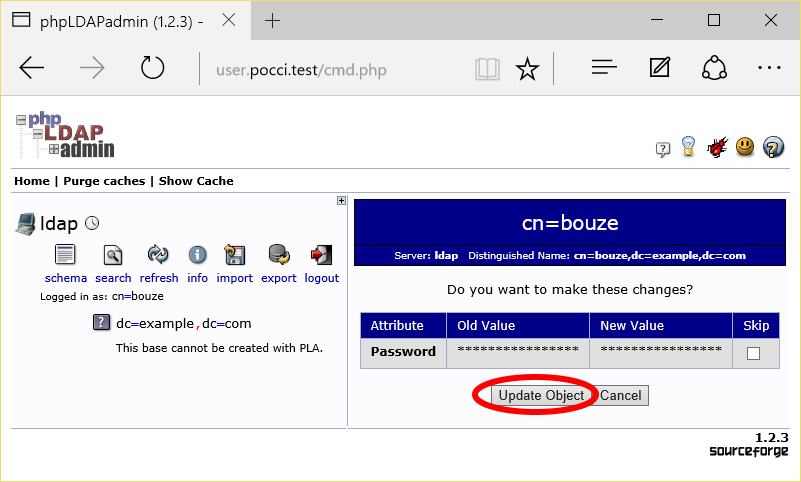
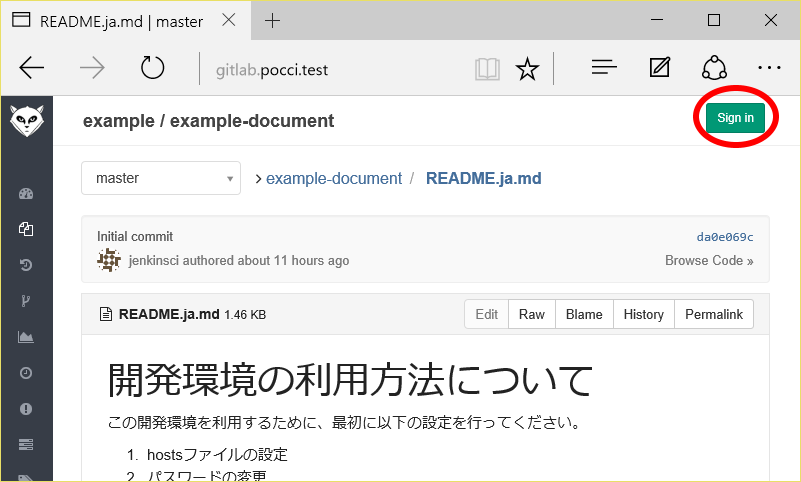
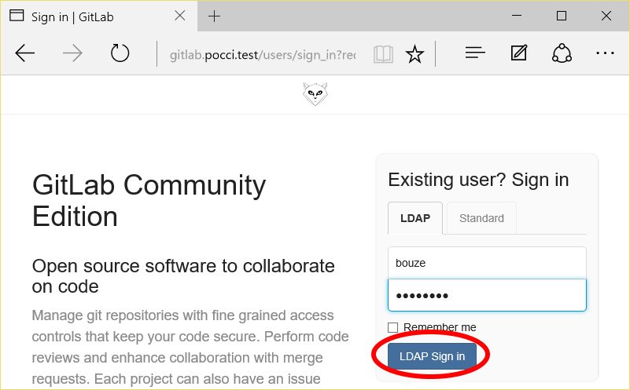
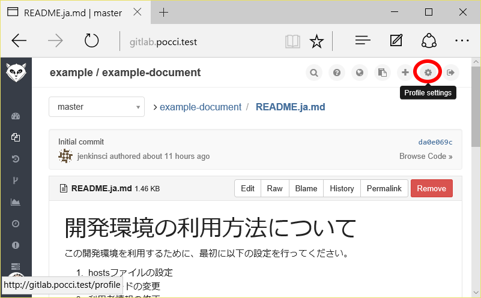
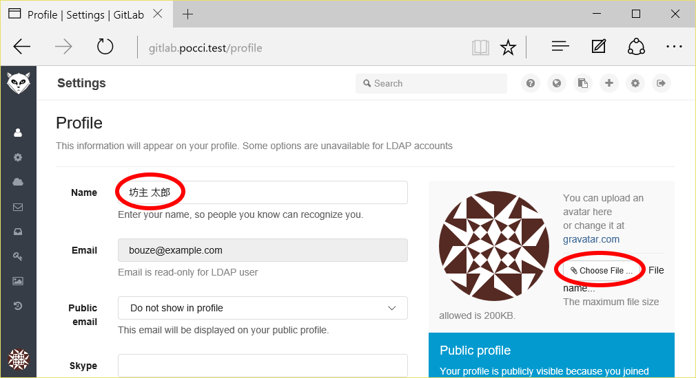
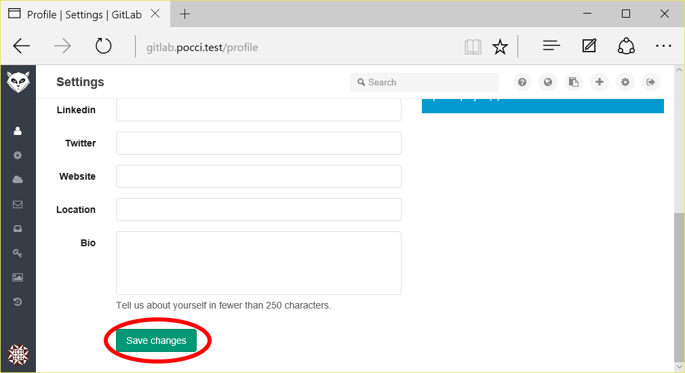

開発環境の利用方法について
==========================

この開発環境を利用するために、最初に以下の設定を行ってください。
1.  hostsファイルの設定
2.  パスワードの変更
3.  利用者情報の修正


### 1. hosts ファイルの設定
開発環境上の各サービスに接続するためには、
あなたの PC の hosts ファイル (`C:\Windows\System32\drivers\etc\hosts`)
に以下の記述を追加する必要があります。

```
XXX.XXX.XXX.XXX user.pocci.test gitlab.pocci.test jenkins.pocci.test sonar.pocci.test kanban.pocci.test
```

この設定を行うことにより、以下の URL でサービスにアクセスできます。

URL                        | サービス                                                | 主な用途
-------------------------- | ------------------------------------------------------- | ---------------------------------------------
http://user.pocci.test/    | [phpLDAPadmin](http://phpldapadmin.sourceforge.net/)    | パスワード変更
http://gitlab.pocci.test/  | [GitLab](https://gitlab.com/)                           | コードリポジトリ管理 / チケット (Issue) 管理
http://jenkins.pocci.test/ | [Jenkins](https://jenkins-ci.org/)                      | CIジョブ管理
http://sonar.pocci.test/   | [SonarQube](http://www.sonarqube.org/)                  | コード品質分析
http://kanban.pocci.test/  | [GitLab Kanban Board](http://kanban.leanlabs.io/)       | かんばんボード


### 2. パスワードの変更
以下の手順でパスワードの変更を行ってください。

1.  `http://user.pocci.test/` にアクセスし、**login** をクリックする。

    

2.  **Login DN** と **Password** を入力し、**Authenticate** をクリックしてログインする。
    *   **Login DN** : `cn=ユーザー名,dc=example,dc=com`
    *   **Password** : `password`

    

3.  左上の **cn=ユーザー名** の場所をクリックする。

    

4.  表示された画面を一番下までスクロールして、
    **Password** に任意のパスワードを入力し、**Update Object** をクリックする。

    

5.  変更内容の確認画面が表示されるので、**Update Object** をクリックする。

    


### 3. 利用者情報の修正
以下の手順で GitLab の利用者情報修正を行ってください。

1.  `http://gitlab.pocci.test/` にアクセスし、右上の **Sign in** をクリックする。

    

2.  ユーザー名、パスワードを入力し、**LDAP Sign in** をクリックする。

    

3.  右上の、**Profile settings** をクリックする。

    

4.  **Name** を本名（もしあなたが日本人ならば日本語表記）に変更し、
    **Choose File...** で画像ファイルを選択してください。

    
    *   画像は顔写真である必要はありません（イラストでもOKです）が、
        混乱のもとになるので他人の顔写真を使うのはやめましょう。

5.  一番下までスクロールして、**Save changes** をクリックしてください。

    

