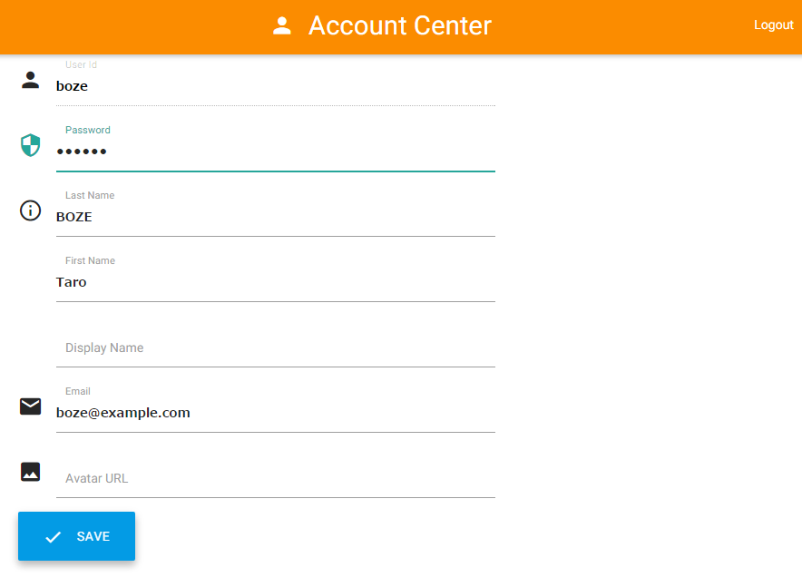

How to Use the Development Environment
======================================

[English](./README.en.md) | [日本語](./README.ja.md)


Contents
--------
*   [A. What to Do First](#a-)
*   [B. Functions That Are Quite Useful](#b-)
*   [C. Source Code Update Rules](#c-)


A. What to Do First
-------------------

To use this development environment, first configure the following settings.
1. Host File Setting
2. Changing the Password
3. Profile (Name and Avatar) Settings
4. Mail Notification Setting


### 1. Host File Setting
To connect to each service in the development environment,
you need to add the following description to the hosts file
(`C:\Windows\System32\drivers\etc\hosts`) of the PC that you are using.

```
XXX.XXX.XXX.XXX user.pocci.test gitlab.pocci.test jenkins.pocci.test sonar.pocci.test
```

Configuring this setting allows you to access the services using the following URLs.

URL                        | Service                                                 | Main applications
-------------------------- | ------------------------------------------------------- | ---------------------------------------------
http://user.pocci.test/    | [Account Center (LDAP)](https://github.com/xpfriend/pocci-account-center)    | Change password
http://gitlab.pocci.test/  | [GitLab](https://gitlab.com/)                           | Code repository management / Ticket (issue) management
http://jenkins.pocci.test/ | [Jenkins](https://jenkins-ci.org/)                      | CI job management
http://sonar.pocci.test/   | [SonarQube](http://www.sonarqube.org/)                  | Code quality analysis


### 2.  Changing the Password
Change the password as described below.

1.  Access `http://user.pocci.test/`, and then enter **User Id** and **Password**.

    

2.  Enter new password in **Password** and click **SAVE**.

    


### 3.  Profile (Name and Avatar) Settings
Correct the user information of GitLab as described below.

1.  Access `http://gitlab.pocci.test/`.

2.  Enter the user name and password and then click **Sign in**.

    ![GitLab - Sign in] (images/gitlab-02.png)

3.  Click **Profile settings** on the left side of the screen.

    ![GitLab - Click Profile settings] (images/gitlab-03-1.png)
    *  If only icons are displayed on the left side of the screen,
        text will also be displayed if you increase the width of the window.

4.  Change the name in **Name** to your real name (use Japanese characters if you are Japanese)
    and then select an avatar file with **Choose File...**.

    ![GitLab - Change Profile settings] (images/gitlab-04.png)

5.  Scroll to the very bottom and then click **Save changes**.

    ![GitLab - Save changes] (images/gitlab-05.png)

### 4. Mail Notification Settings
1.  Click **Notifications** on the left side of the screen.

    ![GitLab - Notifications] (images/gitlab-06.png)

2.  Select a level for **Notification level** and then click **Save changes**.
    (We recommend selecting **Watch** initially.)

    ![GitLab - Notification form] (images/gitlab-07.png)


B. Functions That Are Quite Useful
----------------------------------
If you register an SSH key in GitLab, you will not need
to enter your password each time you access the Git repository.

1. Create an SSH key.  
    An SSH key can be created as described below.
    1.  Open a shell (Git Bash on a Windows PC) 
        and then execute `ssh-keygen -t rsa`.
    2.  A number of questions will be displayed but it is normally OK to just press the Enter key.

2. Register the SSH key.  
    An SSH key can be registered to GitLab as described below.
    1.  Sign in to GitLab and then open the **Profile settings** screen.
    2.  Click **SSH Keys** on the left side of the screen.

        ![GitLab - SSH Keys] (images/gitlab-08.png)

    3.  Click **Add SSH Key** at the top right of the screen.

        ![GitLab - Add SSH Key] (images/gitlab-09.png)

    4.  Execute `cat ~/.ssh/id_rsa.pub` in a shell and then
        copy the displayed character string.

    5.  Paste the copied character string in **Key** and then enter any character string in **Title**.
        * If there is a line break in the middle of the character string in **Key**, delete it. 
          Registration will not be possible if it is not entered as one line.

3.  Access the repository using SSH.  
    When accessing the repository using the registered SSH key,
    use the URL for SSH access.
    The URL for SSH access is displayed on the top screen of the project.

    ![GitLab - SSH URL] (images/gitlab-11.png)


C. Source Code Update Rules
---------------------------
In this XXXX project, update the source code in accordance with the following rules.

* Before starting the update, check that there is an Issue for the work you are about to carry out.
  If there is not, create an Issue immediately and then start the work.
* Do not directly push to a master branch.


### Source code update procedure
1.  Create a branch (assign the name `issue-number`) before you update the source code.

    ```bash
    $ git checkout -b issue-2
    ```

2.  Commit the correction to the created branch. (Corrections can be committed at any time.)
    The corresponding issue title and issue number must be included in the format
    of `Issue title (#Issue number)` on the first line of the commit message.

    ```bash
    $ git add --all
    $ git commit -m "Add the README file (#2)"
    ```

3.  Push commits to the server.

    ```bash
    $ git push origin issue-2
    ```

    * Even if there seems to be no convenient break in the work,
      push commits frequently so that the progress information can be shared.

4.  Submit a merge request to the master branch.

    1.  Click **Merge Requests** on the left side of the screen.

        ![Merge Requests Button] (images/gitlab-12.png)

    2.  Click the ![+ New Merge Request] (images/gitlab-13.png) button at the top right of the screen.
    3.  Select the branch you created with **Select branch** of **Source branch**,
        select the master branch with **Select branch** of **Target branch**,
        and click the ![Compare branches] (images/gitlab-15.png) button.

        ![Branch Selection] (images/gitlab-14.png)

    4.  Click the **Changes** tab and check the changes again,
        and if there is no problem, enter the following and then click the **Submit new merge request** button.
        * **Title:** Title of merge request. Be sure to include `#Issue number`.
        *  **Description:** Enter an additional description if necessary.
        * **Assign to:** Select a reviewer.

5.  The reviewer reviews the corrections, and if there is no problem, merges the branch with the master branch.
    If there is something that needs fixing, the reviewer enters a comment in the corresponding place of the code 
    and sends a request to make a correction to the creator.
