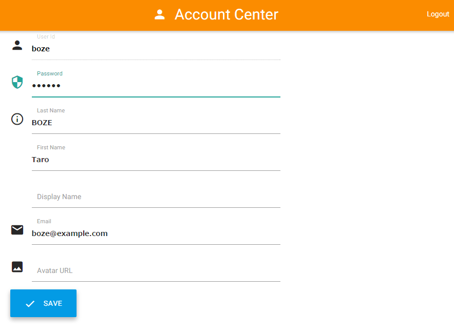
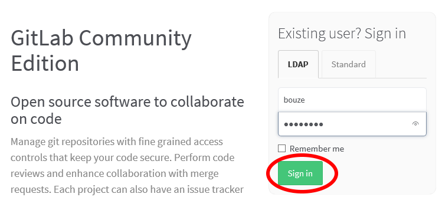
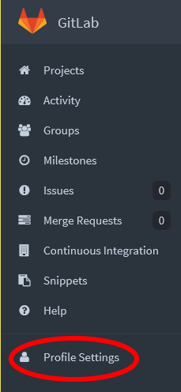
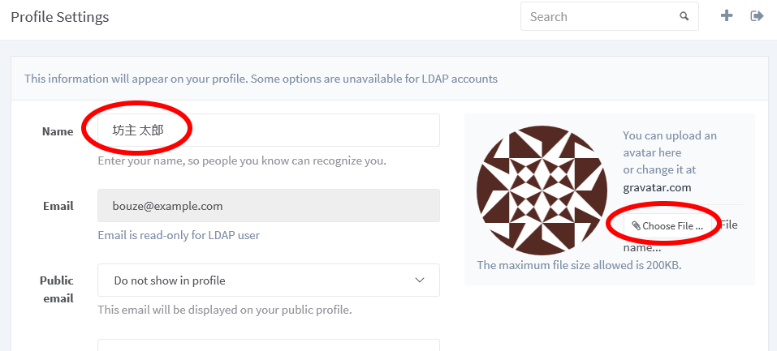
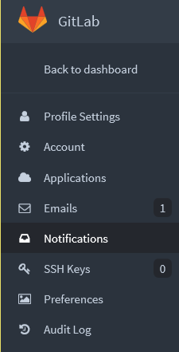
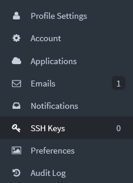
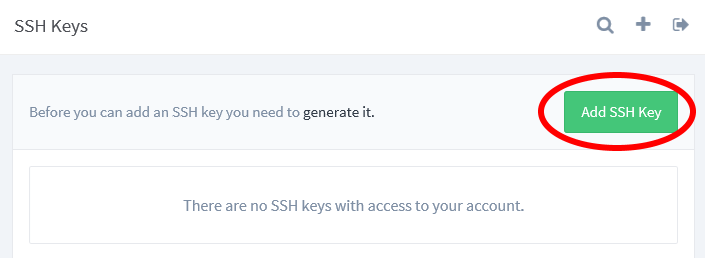
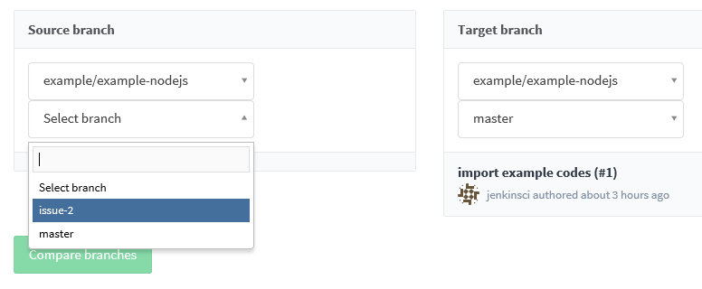

開発環境の利用方法について
==========================

[English](./README.en.md) | [日本語](./README.ja.md)

目次
----
*   [A. 最初にやること](#a-)
*   [B. ちょっと便利な機能](#b-)
*   [C. ソースコード更新ルール](#c-)


A. 最初にやること
-----------------

この開発環境を利用するために、最初に以下の設定を行ってください。
1.  hostsファイルの設定
2.  パスワードの変更
3.  プロファイル（名前と顔写真）設定
4.  メール通知設定


### 1. hosts ファイルの設定
開発環境上の各サービスに接続するためには、
使用している PC の hosts ファイル (`C:\Windows\System32\drivers\etc\hosts`)
に以下の記述を追加する必要があります。

```
XXX.XXX.XXX.XXX user.pocci.test gitlab.pocci.test sonar.pocci.test
```

この設定を行うことにより、以下の URL でサービスにアクセスできます。

URL                        | サービス                                                | 主な用途
-------------------------- | ------------------------------------------------------- | ---------------------------------------------
http://user.pocci.test/    | [Account Center (LDAP)](https://github.com/xpfriend/pocci-account-center)    | パスワード変更
http://gitlab.pocci.test/  | [GitLab](https://gitlab.com/)                           | コードリポジトリ管理 / チケット (Issue) 管理
http://sonar.pocci.test/   | [SonarQube](http://www.sonarqube.org/)                  | コード品質分析


### 2. パスワードの変更
以下の手順でパスワードの変更を行ってください。

1.  `http://user.pocci.test/` にアクセスし、**User Id** と **Password** を入力し、**LOGIN** をクリックしてログインする。

    

2.  **Password** に新しいパスワードを入力し、**SAVE** をクリックする。

    


### 3. プロファイル（名前と顔写真）設定
以下の手順で GitLab の利用者情報修正を行ってください。

1.  `http://gitlab.pocci.test/` にアクセスする。

2.  ユーザー名、パスワードを入力し、**Sign in** をクリックする。

    

3.  画面左側の **Profile settings** をクリックする。

    
    *   画面左側にアイコンだけが表示されている場合は、
        ウインドウを横に広げると文字も表示されるようになります。

4.  **Name** を本名（もしあなたが日本人ならば日本語表記）に変更し、
    **Choose File...** で顔写真ファイルを選択する。

    
    *   「顔写真」と書きましたが、他の人と区別できる画像であれば、
        別に「写真」じゃなくても構いませんし、「顔」じゃなくても構いません。
        ただし他人の顔写真を使うのは誤解のもとなのでやめましょう。

5.  一番下までスクロールして、**Save changes** をクリックする。

    

### 4. メール通知設定
1.  画面左側の **Notifications** をクリックする。

    

2.  **Notification level** を選択し、**Save changes** をクリックする。
    (最初のうちは **Watch** がおすすめです)

    


B. ちょっと便利な設定
---------------------
GitLab に SSH キーを登録しておくと、
Git リポジトリにアクセスする際に毎回パスワード入力を行う必要がなくなります。

1.  SSH キーを作成する。  
    以下のような手順で SSH キーを作成することができます。
    1.  シェル (Windows PC の場合は Git Bash) を開き、
        `ssh-keygen -t rsa` を実行する。
    2.  質問がいくつか出てくるが、通常はすべてエンターだけでOK。

2.  SSH キーを登録する。  
    以下のような手順で SSH キーを GitLab に登録することができます。
    1.  GitLab にサインインし、**Profile settings** 画面を開く。
    2.  画面左側の **SSH Keys** をクリックする。

        

    3.  画面右上の **Add SSH Key** をクリックする。

        

    4.  シェルで `cat ~/.ssh/id_rsa.pub` を実行し、
        表示される文字列をコピーする。

    5.  **Key** にコピーした文字列を貼り付け、**Title** に任意の文字列を入力する。
        *   **Key** の途中に改行が入っている場合は削除してください。1行で入力しないと正常に登録できません。

3.  SSH でリポジトリにアクセスする。  
    登録した SSH キーを使ってリポジトリにアクセスする場合は、
    SSH アクセス用の URL を使用します。
    SSH アクセス用の URL はプロジェクトのトップ画面に表示されます。

    


C. ソースコード更新ルール
-------------------------
本XXXXプロジェクトにおいては、以下のルールでソースコードの更新を行ってください。

*   更新を始める前に、これから行う作業に対応する Issue があることを確認する。
    もしなければ、すぐに Issue を作成し、その後で作業を開始すること。
*   master ブランチには直接プッシュしないこと。


### ソースコード更新の手順
1.  ソースコード更新の前に、ブランチを作成する（名前は `issue-番号` とする）。

    ```bash
    $ git checkout -b issue-2
    ```

2.  作成したブランチに修正をコミットする。（コミットのタイミングは自由）
    コミットメッセージの1行目には、`Issue タイトル (#Issue番号)`
    という形式で対応する Issue のタイトルと Issue 番号を記載すること。

    ```bash
    $ git add --all
    $ git commit -m "READMEファイルを追加する  (#2)"
    ```

3.  サーバにコミットをプッシュする。

    ```bash
    $ git push origin issue-2
    ```

    *   作業に区切りがついていない場合でも、進捗情報を共有するために、
        できるだけ頻繁にプッシュするようにしてください。

4.  master ブランチに対してマージリクエストを行う。

    1.  画面左側の **Merge Requests** をクリックする。

        

    2.  画面右上の  ボタンをクリックする。
    3.  **Source branch** の **Select branch** で自分が作成したブランチを選び、
        **Target branch** の **Select branch** で master ブランチを選択し、
         ボタンをクリックする。

        

    4.  **Changes** タブをクリックして変更内容を再度確認し、
        問題なければ以下を入力して **Submit new merge request** ボタンをクリックする。
        *   **Title:** マージリクエストのタイトル。必ず `#Issue番号` を含めること。
        *   **Description:** 追加説明が必要な場合は入力する。
        *   **Assign to:** レビュワーを選択する。

5.  レビュワーは、修正内容のレビューを行い、問題がなければ master ブランチにマージする。
    指摘事項がある場合はコードの該当箇所にコメントを書き、作成者に修正を依頼する。
